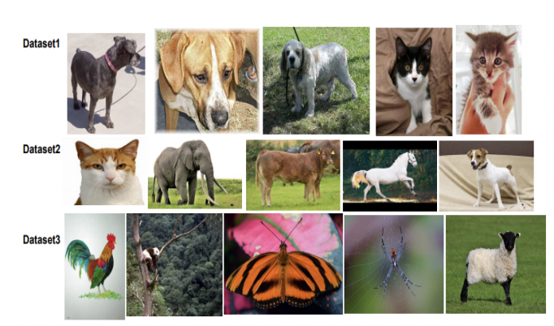
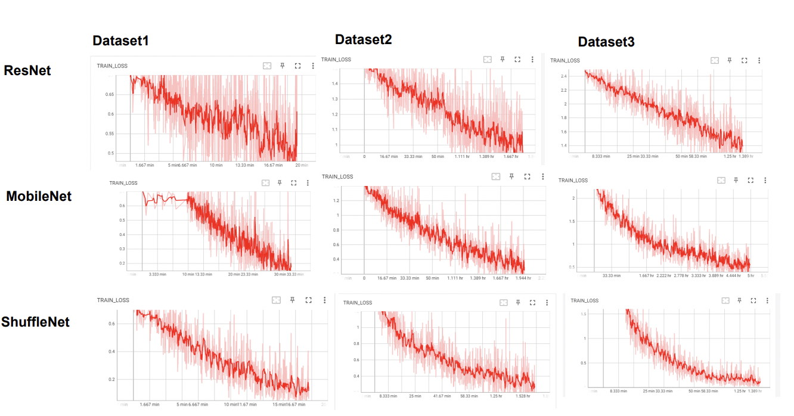
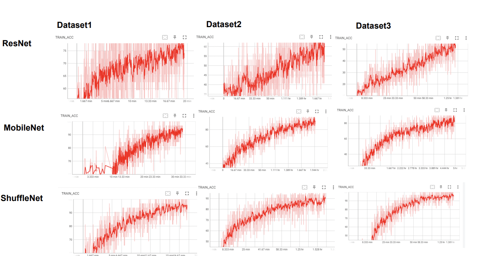
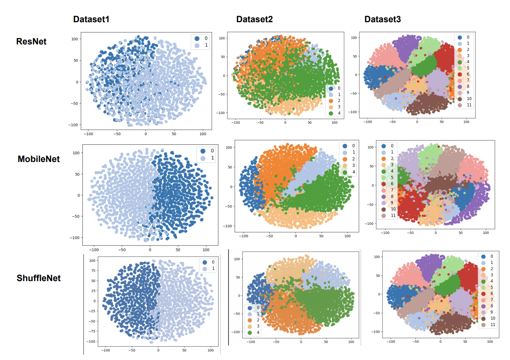
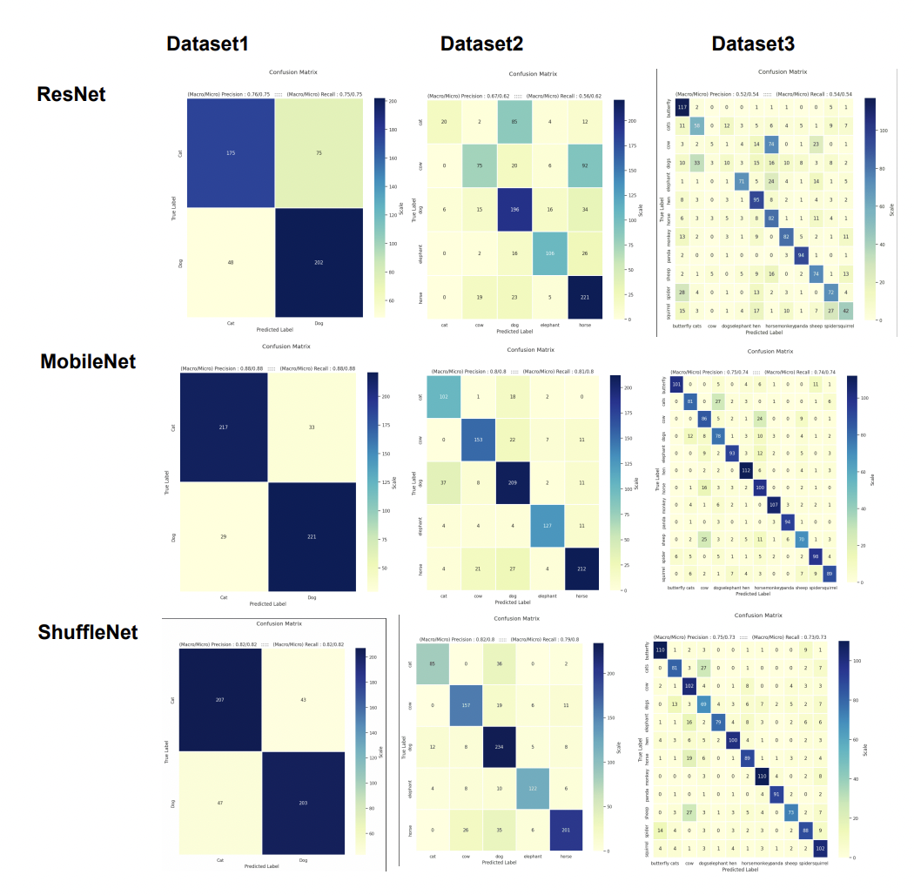
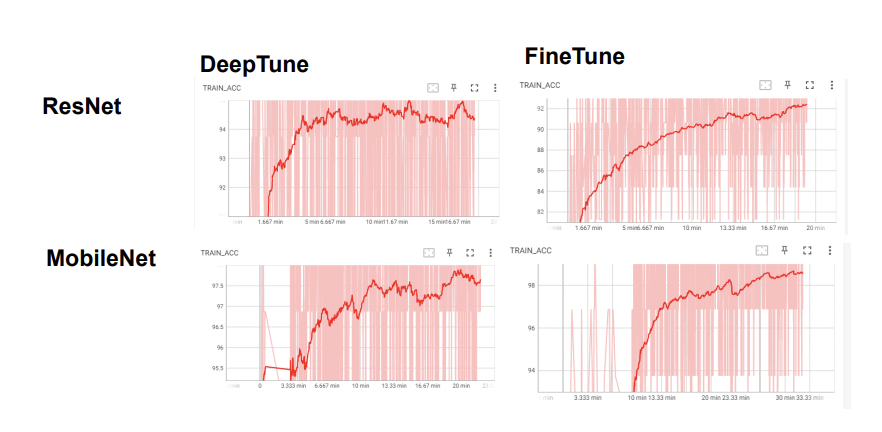

# Animal Classification Application

## 1.	Problem Statement and Introduction:

Efficient and reliable monitoring of wild animals in their Natural habitats is essential to inform conservation and management decisions regarding wildlife species, migration patterns, and habitat protection, and is possible, rehabilitation and grouping species of the same animals together. Processing a large volume of images and videos captured from camera traps manually is extremely expensive, time consuming, and monotonous. This presents a major obstacle to scientists and ecologists to monitor wildlife in an open environment.

Processing a large volume of images and videos captured from camera traps manually is extremely expensive, time-consuming, and monotonous. This presents a major obstacle to scientists and ecologists to monitor wildlife in an open environment. Images captured in a field represent a challenging task while classifying since they appear in a different pose, cluttered background, different lighting and climatic conditions, human photographic errors, different angles, and occlusions.

## 2.	Dataset Selection selection 

There are many datasets available for the animal classification datasets among that we selected below 3 datasets with different classes and different number of images per class.

| Info 		         |Dataset 1|Dataset 2|Dataset 3|
| -----------------------|---------|---------|---------|
| Original  Categories   | 2	  |25       | 12       |		
| Original No. of Images | 25k    | 15.1K   | 17.2K   |
| Modified Categories.   | 2| 5| 12| 
| Modified No. Categories| 5k| 10K| 15K|

The first dataset, called Dataset 1, contains approximately 25,000 RGB images of dogs and cats with varying pixel resolutions, ranging from 320 x 200 to 498 x 480 pixels.  Originally created by Microsoft Research for a Kaggle competition in 2013, we modified this dataset and selected 5,000 images for our training. Images within this dataset are in .jpg format.

	
The second dataset, Dataset 2, was provided by a user named Saumil Agrawal in 2018. This dataset contains around 15,100 images of 25 different animal classes, with a fixed pixel resolution of 1280 x 720 pixels. We observed that this dataset was highly imbalanced, with some classes having only 60 images. To avoid potential bias towards certain classes, we selected only 5 classes with a larger number of images.

The third dataset, Dataset 3, was created by Kaggle user Piyush Kumar in 2019. It contains approximately 17,200 images of various animals, including butterfly, cats, cows, elephants, hens, horses, monkeys, pandas, sheep, spiders, squirrels, among others. Size of the images are ranging from 201 x 300 to 500 x 374 pixels.

**Link to download the datasets.**

Dataset 1: https://www.kaggle.com/competitions/dogs-vs-cats

Dataset 2: https://www.kaggle.com/datasets/saumilagrawal10/animal-image-dataset-resized

Dataset 3: https://www.kaggle.com/datasets/piyushkumar18/animal-image-classification-dataset

## 3. Data Preprocessing

**Data Cleaning:**

	These datasets have some noise. We have cleaned the dataset and after that we have split these datasets into training, validation and testing set. Training set has been used for training the dataset and testing as well as validation set has been used for the evaluation of the dataset.

**Data Processing:**

	Resize: consists of variable-resolution images, while our system requires a constant input dimensionality. There for we have down sampled the 			images to fixed resolution which is suitable for architecture.
	Tensor: convert the NumPy images to torch images.
	Normalize: change the range of pixels.
	ColorJitter: To generate images with randomly brightness contrast and saturation 

	
## 4. Pros and Cons of existing solutions

***Pros***

One of the biggest pros of existing manual animal classification is their ability to provide accurate results. Trained experts in animal classification can achieve high levels of accuracy, especially for challenging or novel species. Humans can adapt to new situations and recognize new animals without requiring extensive retraining.

***Cons***

Manual classification is a timeconsuming process that requires significant human effort, limiting its scalability. Different individuals may classify
the same image differently, leading to potential inconsistencies and biases.

## 5. CNN Models

ResNet18, ShuffleNetV2 and MobileNetV2 are three models which has been used for this study for performance comparision on different datasets. 

The architecture of ResNet18 [2] consists of a series of convolutional layers, followed by a global average pooling layer and a fully connected output layer with softmax activation. The ResNet18 [2] architecture consists of 18 layers, including convolutional layers, max-pooling layers, fully connected layers, and shortcut connections. The shortcut connections allow the network to bypass some of the layers, which helps to mitigate the vanishing gradient
problem and makes it easier to train very deep neural networks.

MobileNetV2 is a lightweight neural network architecture designed for mobile and embedded vision applications. The architecture can be divided into three main parts: the stem, the body, and the head. It uses inverted residual blocks. Inverted residual blocks are composed of three components: a linear bottleneck layer, a non-linear activation function, and a linear projection layer.

The ShuffleNetV2 architecture is composed of several building blocks, including the channel shuffle operation, depthwise separable convolution, and residual connections. The channel shuffle operation is a key component of the ShuffleNetV2 [3]architecture, and it allows for information exchange between channels while reducing computation.

## 6. Experiment Setup

|  	Hyper Parameters	         |Used Hyper Parameter       |
| -----------------------|---------|
| Optimizer   | Adam	  |	
| Loss Function | Cross Entropy Loss    
| Batch Size   | 32
| Epochs | 30

### Hardware Configuration

Hardware:- Training these CNN architectures is extremely computationally intensive. Therefore, all the experiments are carried out on a Google collab and Microsoft Azure. Microsoft Azure has 6 cores ,56 GB ram,12 GB NVIDIA TESLA K80 GPU WITH 380 GB disk space and Google collab has 13 GB Ram ,15 GB GPU WITH 79.2GB Disk space.

### Evaluation

The performance of the proposed method is evaluated by comparing the different models with different metrics. The quality CNN model is evaluated using the
how well they perform on test data. The sensitivity or recall corresponds to the accuracy of positive examples, and it refers to how many examples of the positive classes were labeled correctly. Precision measure is about correctness. It is how “precise” the model is out of those predicted positive and how many of them are actually positive. F-score is determined as the harmonic mean precision and recall. 

## 7. Main Results

Below graph shows the loss of the Architecture on each dataset. Models with lower training loss are better as they are able to fit the training data more accurately. It is clear that MobileNetV2 has lowest training loss in all datasets.

Below graph shows the accuracy of the model on the training data over a time. ShuffleNetV2 and MobileNeV2 achieved almost 98% traning accuracy while
ResNet18 did not perform well. It is underfitted. The model cannot capture the underlying patterns and instead makes a high error assumption about the data.

Plotting the high-dimensional representations of the data points in a low-dimensional space using t-SNE.

Distribution of Datapoints after classification using Confusion Matrix.

The models were evaluated based on testing accuracy, precision, recall, F1 scores, and training time. The MobileNetV2 architecture achieved the highest testing accuracy among all architectures on all three datasets. On Dataset1, MobileNetV2 achieved the highest testing accuracy of 87.60%, followed by ShuffleNetV2 with an accuracy of 82%, and ResNet18 with a low accuracy of 75.40%. On Dataset2, MobileNetV2 achieved an accuracy of 80.22%, followed by ShuffleNetV2 with an accuracy of 79.82%, and ResNet18 with an accuracy of 61.71%. Finally, on Dataset3, MobileNetV2 again achieved the highest accuracy of 73.69%, followed by ShuffleNetV2 with an accuracy of 72.98%, and ResNet18 with an accuracy of 53.50%. More Details for Precision, Recall is given in table.

| Architecture		 | Dataset   | Testing Acc |Precision|Recall  |F1-Scores    |Training time|
| -----------------------|-----------|-------------|---------|--------|-------------|-------------|
| MobileNetV2            | Dataset 1 | 87.60       | 88	     |  88    | 87          |  36 min     |		
| 			 | Dataset 2 | 80.22	   | 80	     |	81    | 80	    |  2 hour     |
| 		         | Dataset 3 | 73.69       | 75      |	74    | 74	    |  5 hour     |
| ShuffleNetV2		 | Dataset 1 | 82          | 82      |  82    | 82          |  20 min     |		
| 			 | Dataset 2 | 79.82	   | 82      |	79    | 79	    |  1.2 hour   |
| 		         | Dataset 3 | 72.98       | 72      |	73    | 72	    |  1.3 hour   |
| ResNet18		 | Dataset 1 | 75.40       | 76      |  75    | 75          |  21 min     |		
| 			 | Dataset 2 | 61.71       | 67      |	56    | 61 	    |  1.1 hour   |
| 		         | Dataset 3 | 53.50	   | 52      |	54    | 53	    |  1.3 hour   |

In our study, results of transfer learnings are better than the scratch training. Training ResNet18 from scratch achieved 75.40% accuracy while in it jumps drastically to 98.20% and 93.00% in Deep tune and finetune respectively. Moreover, It takes less time for training. MobileNetV2 has achieved 96% accuracy on both methods.

| Architecture		 | Dataset   | Testing Acc |Precision|Recall  |F1-Scores    |Training time| Method  |
| -----------------------|-----------|-------------|---------|--------|-------------|-------------|---------|
| ResNet18               | Dataset 1 | 98.20       | 98	     |  98    | 98          |  19 min     | DeepTune| 	
| 			 | Dataset 1 | 93.00	   | 94	     |	93    | 93	    |  30 min     | FineTune|      
| MobileNetV2		 | Dataset 1 | 96.80       | 97      |  97    | 97          |  26 min     | DeepTune|		
| 			 | Dataset 1 | 96.60	   | 97      |	97    | 97	    |  34 min     | FineTune|       

Overall, the results suggest that using DeepTune technique yields higher accuracy and precision scores, while also achieving better recall and F1-scores compared to FineTune. Among the different models tested, ResNet18 with DeepTune achieved the highest accuracy and fastest training time. These findings have important implications for the development of deep learning models for similar applications, highlighting the importance of tuning techniques in
achieving optimal performance.

